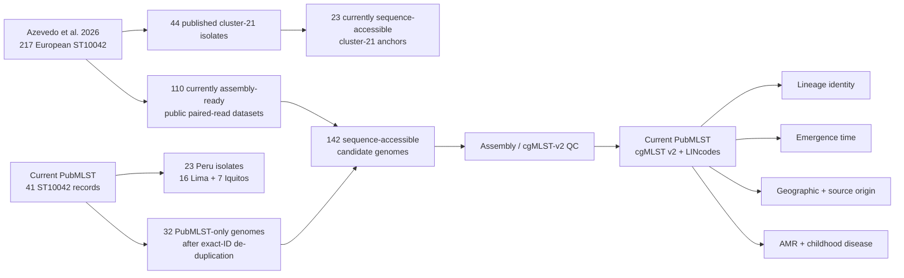

# Global population genomics of *Campylobacter coli* ST10042

This project asks whether the *C. coli* ST10042 isolates we have found in Peru are
part of the same emerging lineage reported recently in Europe, and what the wider
evolutionary, ecological and clinical history of that lineage is.

The European reference is [Azevedo et al. (2026), *Multisectoral Emergence of Multidrug-Resistant Campylobacter coli Sequence Type 10042 Lineage, Europe, 2018–2025*](https://wwwnc.cdc.gov/eid/article/32/10/26-0512_article), who described an emerging
multidrug-resistant ST10042 lineage in nine European countries. We are combining
that published dataset with the current PubMLST ST10042 population and our Peru
isolates from Lima and Iquitos.


## Dataset at a glance

| Dataset / checkpoint | N | What it represents |
|---|---:|---|
| Azevedo published ST10042 collection | 217 | European reference isolates from the 2026 paper |
| Azevedo Figure 4 | 211 | Published cgMLST-v1 analysis after their completeness filtering |
| Azevedo genomes currently assembly-ready from public reads | 110 | Paired FASTQ datasets that we can currently reproduce |
| Published cluster 21 | 44 | Main European cgMLST-v1 cluster in Azevedo et al. |
| Cluster-21 genomes currently sequence-accessible | 23 | Positive reference anchors; availability is Portugal-biased |
| Current PubMLST ST10042 records | 41 | Authenticated current snapshot |
| Current PubMLST records with assemblies | 40 | One no-contig record is Azevedo ES-1, represented by public reads |
| Peru ST10042 isolates | 23 | 16 Lima + 7 Iquitos |
| PubMLST-only additions after exact-ID de-duplication | 32 | Current genomes not already represented by an exact Azevedo accession |
| **Current sequence-accessible candidate set** | **142** | **110 Azevedo + 32 PubMLST-only genomes, before final cgMLST QC** |




## The biological questions

The analysis is organised around four questions.

1. **Are the Peru isolates the same lineage as the European isolates?**
   We want to distinguish simple seven-locus ST10042 membership from genuinely close
   genomic relatedness. The primary comparison uses the current PubMLST
   *Campylobacter* cgMLST v2 scheme (1,142 loci), native LINcodes and pairwise allelic
   distances, with the published Azevedo cluster labels retained as reference
   annotations.

2. **When did this lineage emerge?**
   Once the relevant genomic lineage is defined, we will test for temporal signal and,
   where justified, estimate its timescale using a recombination-aware core-genome
   phylogeny. The aim is to estimate the age of the lineage and, if the data support it,
   the timing of major geographic or host-associated expansions.

3. **Where did it most likely emerge, and in which source reservoir?**
   We will combine phylogeny, sampling date, country and source metadata to ask whether
   the ancestral population is better supported in a particular geographic region and
   host/source reservoir. This requires caution because the available public data are
   strongly shaped by surveillance and sampling intensity; geographic origin will not
   be inferred from the oldest sampled isolate alone.

4. **Are the Peru isolates also MDR, and are they associated with disease in children?**
   We will characterise the AMR determinants reported in the European lineage and
   compare them with the Peru genomes. For Peru isolates linked to child metadata, we
   will then test whether lineage membership and/or AMR genotype are associated with
   diarrhoeal disease rather than asymptomatic carriage.

## Initial exploratory analysis

The analysis that motivated this project is preserved in
[`docs/craig_initial_analysis.md`](docs/craig_initial_analysis.md). It summarises
Craig's initial 40-genome FastTree analysis, including the 23 Peru ST10042 genomes,
the early Peru/European intermixing signal, preliminary AMR observations, and the
interpretation limits of that tree. It is retained as the exploratory starting point;
the current analysis replaces those preliminary phylogenetic comparisons with
quality-controlled cgMLST v2/LIN analysis.

## What we have done, and why

### 1. Reconstructed the published European reference set

We curated the 217 Azevedo ST10042 isolates and retained their published cgMLST-v1
cluster labels. These labels are important historical anchors, but they are **not**
used as the primary nomenclature for the new analysis because PubMLST now provides
cgMLST v2 and LINcodes.

Public archive availability is incomplete. Of the 217 published isolates, 111 run
accessions currently resolve in ENA, but one of those (DK-2) has no FASTQ files.
The assembly-ready European set is therefore **110 isolates**. The remaining
published records are retained in the metadata analysis rather than being silently
discarded.

### 2. Retrieved the current PubMLST ST10042 population

The authenticated PubMLST snapshot contains **41 ST10042 records**, including
**23 Peru isolates**. Forty records have PubMLST contigs. After exact-ID overlap
with the Azevedo set, there are **32 additional PubMLST genomes**.

The current sequence-accessible candidate set is therefore:

**142 genomes = 110 Azevedo read sets + 32 PubMLST-only assemblies**

before final cgMLST quality control and hidden-duplicate checking.

### 3. Moved the primary analysis to current cgMLST v2 + LINcodes

Live PubMLST confirms that the current *Campylobacter jejuni/coli* cgMLST v2 scheme
is **scheme 8 with 1,142 loci**. Its native LINcode hierarchy is now the main
population-genomic framework for this project.

All **23 Peru isolates have native v2 LINcodes**. They are not one tight clone:
they split into multiple sublineages at the 25-, 10- and 5-allele levels.

A particularly important preliminary result is that four Lima 2023 animal isolates
(PubMLST **149884, 149885, 149886 and 149892**; three goats and one chicken) share
the current PubMLST **Cjc_cgc2_5 group 12905** with **UK-7 / PubMLST 119231**, a
published Azevedo cluster-21 isolate.

That is strong evidence of close current-v2 relatedness, but it does **not** yet
prove that the Peru isolates are members of the complete European epidemic lineage:
Azevedo cluster 21 was defined under cgMLST v1, and only part of the published
European collection is currently sequence-accessible.

### 4. Reassembled and quality-checked the accessible European reads

All **110/110** paired Azevedo datasets completed fastp preprocessing and SPAdes
`--isolate` assembly successfully. The validated INNUca-like post-assembly
coverage filter has now also completed for **110/110 genomes with 0 failures**.
After filtering, the median assembly is **1.648 Mb in 27 contigs**. The remaining
largest/most fragmented genomes are retained for cgMLST-v2 QC rather than excluded
from assembly statistics alone.

Initial QC identified several clearly problematic assemblies. The same UK isolates
excluded from the published Azevedo Figure 4 (UK-2, UK-4 and UK-6) also perform
poorly in our current cgMLST-v2 checks, providing an independent validation of the
QC process.

We then compared our local assemblies with their matching official PubMLST
assemblies. This showed that simple contig-length filtering is insufficient for some
samples because low-coverage assembly fragments can create multiple exact allele
hits.

The current validation step therefore applies an **INNUca-like post-assembly
coverage filter**: SPAdes k-mer coverage filtering followed by read mapping and
removal of low-depth contigs. In the first successful pilot this reduced good
overlap genomes, including UK-7, to clean cgMLST-v2 profiles while the genuinely
poor UK-2/UK-4/UK-6 samples remained poor. A corrected pilot now maps the same
fastp-trimmed reads that were used for assembly before this is scaled to all 110
European genomes.


### Assembly / cgMLST validation checkpoint

We used the nine isolates present in both Azevedo and current PubMLST as an internal
validation set. After the INNUca-like coverage filter, the corrected trimmed-read
pilot cleanly separates genomes that are usable for cgMLST v2 from the three
problematic UK genomes already excluded from the published Azevedo Figure 4.

| Isolate | Published label | Filtered contigs | Filtered size (Mb) | Exact v2 loci | Ambiguous loci | Loci without exact hit | Interpretation |
|---|---|---:|---:|---:|---:|---:|---|
| LU-11 | singleton_68 | 31 | 1.732 | 1141 | 0 | 1 | clean |
| ES-1 | cluster_21 | 25 | 1.646 | 1139 | 0 | 3 | clean |
| UK-1 | singleton_64 | 127 | 1.642 | 1139 | 0 | 3 | clean |
| UK-2 | excluded from Fig. 4 | 216 | 1.755 | 1089 | 24 | 53 | fails v2 completeness |
| UK-3 | singleton_60 | 71 | 1.645 | 1137 | 0 | 5 | clean |
| UK-4 | excluded from Fig. 4 | 404 | 2.518 | 1055 | 376 | 87 | poor / mixed |
| UK-5 | singleton_82 | 36 | 1.650 | 1137 | 1 | 5 | usable; one ambiguous locus |
| UK-6 | excluded from Fig. 4 | 233 | 1.928 | 1076 | 79 | 66 | fails v2 completeness |
| **UK-7** | **cluster_21** | **25** | **1.650** | **1139** | **0** | **3** | **clean cluster-21 anchor** |

The important control is UK-7: the unfiltered SPAdes assembly contained many
duplicate exact allele hits, but coverage filtering reduces it to **1139 unique
exact loci, 0 ambiguous loci and only 3 loci without an exact hit**. Conversely,
UK-2/UK-4/UK-6 remain poor after filtering, matching their published exclusion.
This supports applying the same coverage-filtering strategy to the full 110-isolate
Azevedo read set.

### Where the four biological questions stand now

| Question | Current evidence | What remains |
|---|---|---|
| Are Peru and European isolates the same lineage? | Four Lima 2023 animal isolates share current `Cjc_cgc2_5 group 12905` with UK-7, a published cluster-21 isolate. | Type the full accessible Azevedo set under v2/LIN and calculate Peru-to-European allelic distances. |
| When did the lineage emerge? | Not yet estimated. The dataset now has the dated isolates needed to test temporal signal. | Build a recombination-aware core phylogeny, test root-to-tip/temporal signal, then date only if supported. |
| Where / in which reservoir did it emerge? | The published lineage spans countries and human, livestock and food sources; Peru adds human and animal sampling. | Reconstruct ancestral geography/source while accounting for severe sampling imbalance and missing European genomes. |
| Are Peru isolates MDR and clinically important? | Not yet tested systematically in the 23 Peru ST10042 genomes. | Call AMR determinants and link Peru genomes to case/control phenotype (diarrhoea vs asymptomatic carriage). |

## What we are trying to do next

The immediate goal is to obtain one quality-controlled cgMLST-v2/LIN representation
for every usable genome in the 142-genome accessible set. We will then map the
published Azevedo v1 clusters onto the current v2/LIN hierarchy and determine exactly
where each Peru isolate sits.

That leads directly to the four biological analyses:

- **Lineage identity:** calculate Peru-to-European allelic distances, identify nearest
  neighbours, and determine whether the Peru genomes fall inside, immediately beside,
  or outside the genomic space occupied by published European cluster 21.
- **Emergence time:** build a recombination-aware core-genome phylogeny for the
  relevant lineage, test temporal signal, and perform molecular-clock dating only if
  the signal is adequate.
- **Geographic/source origin:** reconstruct likely ancestral geography and host/source
  states using dated phylogeny plus metadata, while explicitly accounting for uneven
  sampling and the 107 currently unavailable Azevedo genomes.
- **AMR and disease:** compare European and Peru AMR genotypes, then link the Peru
  genomes to child case/control phenotype to test whether the lineage and its AMR
  profile are enriched among diarrhoeal cases.

The longer-term result should therefore be more than a statement that ST10042 occurs
in both Europe and Peru. We want to reconstruct **what the lineage is, when it arose,
where and in which reservoir it most plausibly emerged, how it spread, whether the
Peru population belongs to the same expansion, and whether that population is
clinically important in children.**

## Full cgMLST-v2 exact-hit QC checkpoint

The sequential scheme-8 screen has now completed for all **110 filtered Azevedo
assemblies**:

| QC result | N |
|---|---:|
| Genomes queried | 110 |
| <=25 loci without an exact known PubMLST allele hit | **105** |
| >25 loci without an exact known allele hit | **5** |
| Zero ambiguous exact-hit loci | **106** |
| One or more ambiguous loci | **4** |

The five genomes above the 25-locus diagnostic threshold are **UK-4 (87), UK-6
(66), UK-2 (53), PT-41 (43) and PT-58 (28)**. The three UK genomes are the same
poor assemblies excluded from Azevedo Figure 4. PT-41 and PT-58 have zero ambiguous
loci and therefore remain under review until full allele calling distinguishes
genuine novel alleles from missing loci.

Crucially, **all 23 currently accessible published cluster-21 genomes are clean at
this checkpoint**: each has only 1–10 loci without an exact known-allele hit and
none has an ambiguous exact-hit locus. This gives a strong reference set for the
Peru comparison.

The next step is to freeze the current PubMLST scheme-8 allele definitions/profiles
and perform full allele calling so genuine novel alleles are not misclassified as
missing data.

## Planned downstream analyses

Once the current cgMLST-v2/LIN dataset is finalised, the project will move through
five linked analyses:

| Analysis | Main tool / framework | Main question |
|---|---|---|
| LINcode export + allele distances | PubMLST cgMLST v2 / LIN | Which Peru genomes belong to the same genomic lineage as the European expansion? |
| Pangenome | Panaroo | What core/accessory gene-content differences distinguish sublineages, countries and sources? |
| AMR | AMRFinderPlus + targeted variant checks | Do Peru isolates carry the same MDR backbone and regulatory variants as the European lineage? |
| Virulence | VFDB-based screen | Do Peru sublineages differ in virulence-gene content or gene integrity? |
| Recombination + dating | Gubbins → temporal-signal tests → BactDating/clock sensitivity analysis | What is the clonal history, when did the lineage emerge, and can individual subclusters be dated? |

Dating will only be attempted after recombination masking and a formal temporal-signal
test. Geographic and source-reservoir origin will then be reconstructed on the
recombination-aware dated lineage, with sampling bias explicitly considered.

## Important interpretation limits

ST10042 by itself does not establish recent shared ancestry. Likewise, a FastTree
topology alone is not sufficient to infer transmission direction or geographic
origin.

The current result that four Peru isolates share a 5-allele cgMLST-v2 group with a
known European cluster-21 anchor is **positive evidence of close relatedness**, but
the v2 group must not simply be renamed “cluster 21”. The two classifications were
defined using different cgMLST schemes.

Public sequence availability is also incomplete and geographically biased. In
particular, only 23/44 published cluster-21 isolates are currently sequence-accessible,
with a strong Portugal bias. Failure to match the accessible genomes therefore
cannot by itself exclude membership of the wider published lineage.

## Repository layout

```text
config/     fixed analysis settings
data/       tracked manifests and local sequence inputs (large data ignored by git)
docs/       detailed analysis notes, checkpoints and interpretation
hpc/        Puma/Slurm wrappers and setup notes
scripts/    data retrieval, QC, assembly and population-genomic analysis helpers
results/    generated outputs (ignored by git)
schema/     local cgMLST resources (ignored by git)
```

The detailed, chronological workflow and technical checkpoints are in
[`docs/analysis_plan.md`](docs/analysis_plan.md).

## HPC quick start

```bash
git clone git@github.com:Benizao1980/Ccoli-ST10042-global.git
cd Ccoli-ST10042-global

conda env create -f environment.yml
conda activate st10042
```

PubMLST OAuth setup, Slurm submission wrappers and the current HPC workflow are
documented in [`hpc/README.md`](hpc/README.md).

## Data policy

Raw reads, assemblies, credentials, schemas and large generated outputs are not
committed. Small public metadata/manifests required to reproduce the analysis are
tracked.

## Status

Active analysis, October 2026. Peru/global findings are preliminary until the full
quality-controlled cgMLST-v2/LIN analysis, AMR comparison and epidemiological
linkage are complete.
