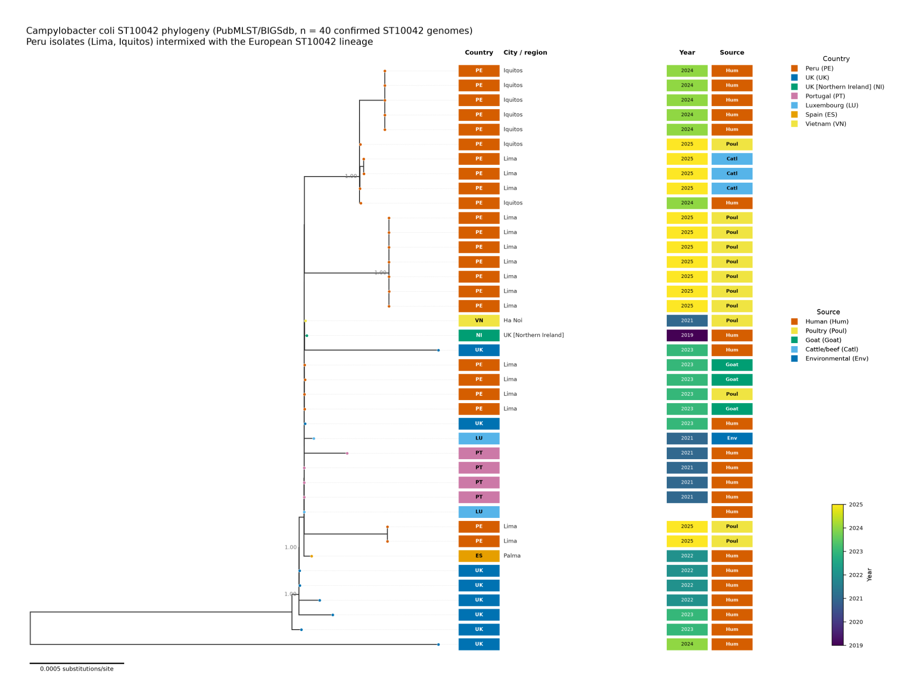

# Craig's initial exploratory ST10042 analysis

This page preserves the initial exploratory analysis that motivated the global ST10042 project. It should be read as **hypothesis-generating** rather than as the final population-genomic analysis.

## Input data

Craig's initial analysis used a PubMLST/BIGSdb query restricted specifically to *Campylobacter coli* ST10042 and combined:

- a 40-genome FastTree maximum-likelihood tree;
- associated PubMLST/BIGSdb metadata;
- the newly available Peru genomes; and
- comparison with Azevedo et al. (2026), *Multisectoral Emergence of Multidrug-Resistant Campylobacter coli Sequence Type 10042 Lineage, Europe, 2018–2025*.

All 40 genomes in the exploratory tree were confirmed ST10042 records rather than genomic near-neighbours. The tree included **23 Peru genomes**: **16 Lima** and **7 Iquitos/Loreto**. Other genomes represented the UK (including Northern Ireland), Portugal, Luxembourg, Spain and Vietnam.

One Spain metadata record (PubMLST isolate 151737; cjeju23_97) did not have a matching tree tip and was excluded from tree-based interpretation.

## Initial tree

The original tree export is intended to live at:

    docs/figures/craig_initial_ST10042_tree.png

Original file SHA256:

    71ecebd7c4264082b6f1c5f776aa363ee65d1cf82af66b8f673361383425cae9

The tree was annotated by country, city/region, year and source.

## Main observations from the exploratory tree

### 1. Peru was not a distant ST10042 offshoot

The Peru genomes were interspersed within the broader ST10042 population rather than forming a deeply divergent South American branch. The maximum root-to-tip distance across the 40-genome tree was only about 0.0022 substitutions/site, consistent with a relatively low-diversity, recently expanded lineage.

### 2. A Peru/European mixed subclade was immediately apparent

A supported terminal clade contained four 2023 Lima livestock isolates together with genomes from Luxembourg, Portugal and the UK. Those countries overlap with the geographic composition of Azevedo et al.'s large European cluster 21.

This was the first observation suggesting that some Peru isolates might sit very close to the European MDR lineage.

### 3. A Peru-dominant branch included both Lima and Iquitos

A second supported sub-lineage contained 17 Peru genomes from Lima and Iquitos together with a small number of non-Peru genomes, including Vietnam and the UK.

Within this branch, the exploratory tree showed:

- a very tight group containing Iquitos human-stool genomes and Lima cattle/beef genomes; and
- a second tight Lima poultry/meat grouping.

These patterns suggested geographically dispersed circulation within Peru and possible local amplification in the poultry supply chain.

### 4. Preliminary AMR results strengthened the link

Three Lima goat isolates from the mixed Peru/European part of the tree (PubMLST IDs **149884, 149885 and 149886**) had already been screened in the Peru dataset. All three carried:

- gyrA T86I;
- tet(O); and
- the blaOXA-61 promoter -57G>T variant.

They lacked the 23S rRNA A2075G macrolide-resistance mutation.

This profile is closely concordant with the conserved fluoroquinolone, tetracycline and beta-lactam resistance backbone reported by Azevedo et al.

## What the initial analysis did **not** establish

The FastTree result is deliberately retained as the project's starting point, but it should not be used to claim:

- formal membership of published cluster 21;
- a single introduction into Peru;
- direct transmission between Lima and Iquitos;
- Europe-to-Peru or Peru-to-Europe directionality; or
- outbreak causality.

Those questions require the matched **1,343-locus PubMLST cgMLST v1** analysis, allelic-distance calculations, and ultimately higher-resolution recombination-aware analysis with epidemiological context.

## How this feeds into the current project

The current repository expands the initial analysis in two directions:

1. reproduce the Azevedo 217-isolate reference analysis and its <=5-allele clusters; and
2. add **all current PubMLST ST10042 genomes**, not only the initial 40-genome subset.

The key quantitative follow-up is therefore:

> For every Peru ST10042 genome, what is the minimum cgMLST allelic distance to the Azevedo population, and specifically to published cluster 21?

The exploratory FastTree remains useful as provenance: it records the observation that prompted the formal global analysis.
